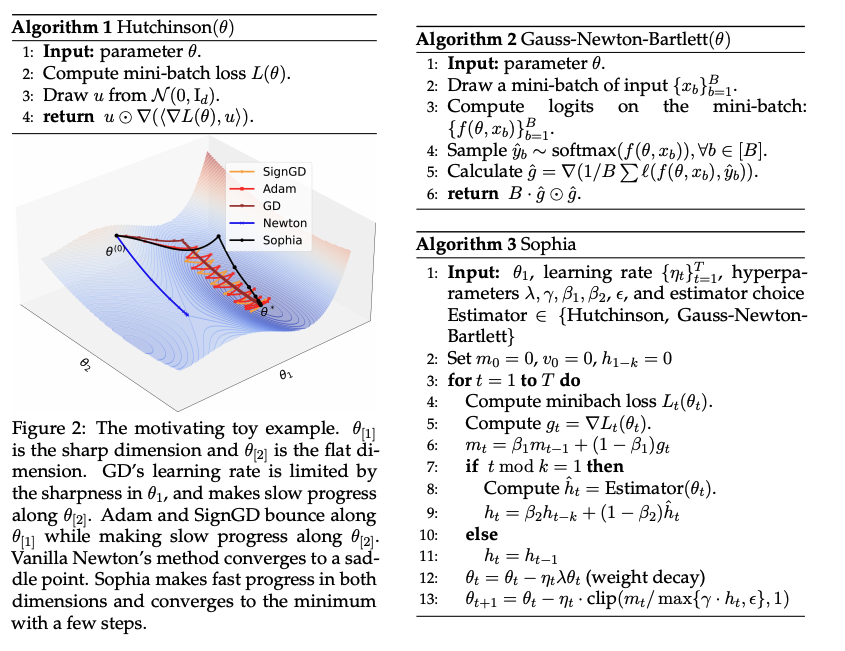

# Sophia - JAX

</img>

JAX implementation of the [Sophia optimizer](https://arxiv.org/abs/2305.14342) for LLM pre-training. Official PyTorch implementation is here: https://github.com/Liuhong99/Sophia

In the paper, Sophia is reported to be 2x faster than Adam on GPT-2.

In the wild it's recently been battle-tested on large-scale runs at Meta and a similar speed-up was observed as well: https://x.com/ArmenAgha/status/1780149168692158658

## TODO
- [ ] Reproduce pretraining results with GPT models
- [ ] Comparisons to AdamW, LION, etc.
- [ ] etc
